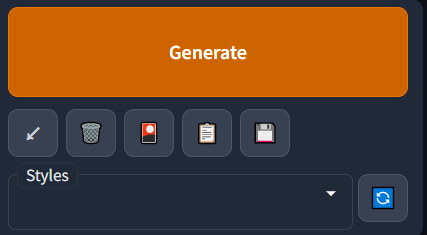

# 详细介绍

## 使用

### `t2i`

以文生图  
权限ID: `xyz.cssxsh.mirai.plugin.stable-diffusion-helper:txt2img`  
例子:
```log
t2i 
steps=50
width=360
height=540
#德克萨斯
night, rain, wet
```
```log
t2i 123456
(8k, RAW photo, best quality, masterpiece:1.2), (realistic, photo-realistic:1.37),omertosa,1girl,(Kpop idol), 
(aegyo sal:1),cute,cityscape, night, rain, wet, professional lighting, photon mapping, radiosity, 
physically-based rendering, <lora:arknightsTexasThe_v10:1>, <lora:koreanDollLikeness_v10:0.5>,Black pantyhose
```

* 设置种子 `t2i $seed`
* 设置参数 `key=value`
* 使用Styles `#xxx`
* 第二行开始才会计入 `prompt`, 所以要两行以上才会触发指令

支持的参数
* `height` Height `360`
* `width` Width `540`
* `sampler_name` Sampling method `Euler a`
* `steps` Sampling steps `32`
* `batch_size` Batch size `1`
* `n_iter` Batch count `1`
* `cfg_scale` CFG Scale `数字`
* `restore_faces` Restore faces `false`/`true`
* `tiling` Tiling `false`/`true`
* `enable_hr` Hires. fix `false`/`true`
* `hr_second_pass_steps` Hires Steps `0`
* `denoising_strength` Denoising strength `0.7`
* `hr_upscaler` Upscaler `Latent`
* `hr_scale` Upscale by `2.0`

@since 0.6.0 新增  
参数别名  
```log
sampler -> sampler_name
count -> n_iter
hr -> enable_hr
```

关于 `Negative Prompt`, 由于他和 `Prompt` 一样是分组多词汇的，同时对他们进行支持很麻烦  
所以如果你要用到 `Negative Prompt`, 建议在 `Styles` 加入常用的词组，然后使用 `#xxx` 调用  
如果你真的要使用, 请安装入下格式  
```
negative_prompt="..."
```

### `i2i`

以图生图  
权限ID: `xyz.cssxsh.mirai.plugin.stable-diffusion-helper:img2img`

支持的参数 基本同 `t2i` 一致

### `extra`

@since 0.6.0 新增  
附加功能  
权限ID: `xyz.cssxsh.mirai.plugin.stable-diffusion-helper:img2img`
```log
extra
```

支持的参数
* `upscaler_1` Upscaler 1
* `upscaler_2` Upscaler 2
* `extras_upscaler_2_visibility` Extras Upscaler 2 Visibility
* `gfpgan_visibility` GFPGAN Visibility
* `codeformer_visibility` CodeFormer Visibility
* `codeformer_weight` CodeFormer Weight
* `resize_mode` Resize Mode `0` `1`
* `upscaling_resize` Upscaling Resize
* `upscaling_resize_w` Upscaling Resize Width
* `upscaling_resize_h` Upscaling Resize Height
* `upscaling_crop` Upscaling Crop

参数别名
```log
1 -> upscaler_1
2 -> upscaler_2
3 -> extras_upscaler_2_visibility
4 -> gfpgan_visibility
5 -> codeformer_visibility
6 -> codeformer_weight
mode -> resize_mode
resize -> upscaling_resize
width -> upscaling_resize_w
height -> upscaling_resize_h
crop -> upscaling_crop
GFPGAN -> gfpgan_visibility
```

### `styles`

权限ID: `xyz.cssxsh.mirai.plugin.stable-diffusion-helper:styles`
查看已经载入的 `Styles`  
例子:
```log
styles 
```
```log
风格 
```
查看具体内容
例子:
```log
style 德克萨斯
```
```log
风格 德克萨斯
```

`Styles` 是 `Stable Diffusion web UI` 自带的功能，用于快捷的填充 `prompt` 和 `negative_prompt`  


### `reload-sd`

重载`client.yml`  
权限ID: `xyz.cssxsh.mirai.plugin.stable-diffusion-helper:reload`  
例子:
```log
reload-sd
```
```log
重载SD
```

### `samplers`

查看支持的采样器
权限ID: `xyz.cssxsh.mirai.plugin.stable-diffusion-helper:samplers`  
例子:
```log
samplers 
```
```log
采样器 
```

### `upscalers`

查看支持的采样器
权限ID: `xyz.cssxsh.mirai.plugin.stable-diffusion-helper:upscalers`  
例子:
```log
upscalers 
```
```log
升频器 
```

### `models`

权限ID: `xyz.cssxsh.mirai.plugin.stable-diffusion-helper:models`  
查看支持的模型
例子:
```log
models 
```
```log
模型集 
```
切换模型
例子:
```log
model xxxxx
```
```log
模型 xxxxx
```